# Controller Chronicles: Gaming Quiz

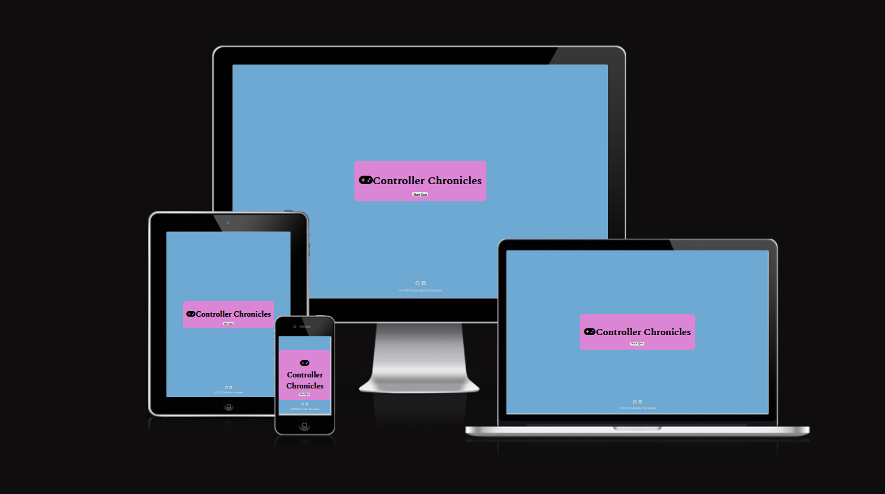

## Introduction

    Controller Chronicles: Gaming Quiz is an interactive quiz game that tests your knowledge of video games. 
    The game presents players with a series of 10 multiple-choice questions 
    related to video games, and they must answer each question within a time limit. 
    The faster and more accurately they answer, the higher their score!

The Colors I went with are :
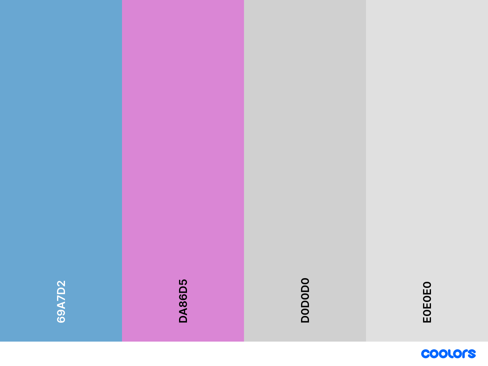

## Table of Contents

- [Controller Chronicles: Gaming Quiz](#controller-chronicles-gaming-quiz)
  - [Introduction](#introduction)
  - [Table of Contents](#table-of-contents)
  - [Wireframes](#wireframes)
  - [Features](#features)
  - [UX Design](#ux-design)
    - [Future Enhancements](#future-enhancements)
  - [Technologies Used](#technologies-used)
  - [Testing](#testing)
    - [User Stories](#user-stories)
  - [Validators Used](#validators-used)
  - [Getting Started](#getting-started)
  - [Demo](#demo)
    - [How To Play](#how-to-play)
  - [Deployment](#deployment)
    - [GitPod](#gitpod)
  - [Run code locally](#run-code-locally)
  - [Cloning](#cloning)
  - [API](#api)
  - [Credits](#credits)
    - [Content](#content)
    - [Media](#media)
  - [Acknowledgements](#acknowledgements)

## Wireframes

     The wireframes below is of the website.

- [wireframes](assets/images/wireframes/project-2.pdf)

## Features

    10 exciting multiple-choice questions about video games.  
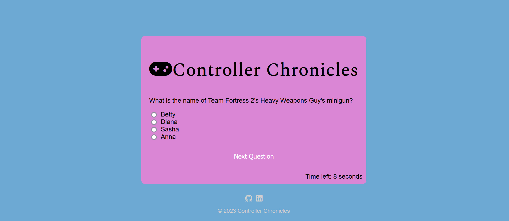

     A timer of 10 seconds for each question.      

     Automatic progression to the next question when the time elapses. 
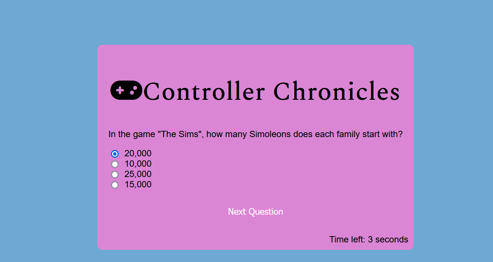

     Real-time score tracking.  

     Username input for submitting high scores to the leaderboard. 

    Leaderboard to display the top 10 high scores achieved by players.
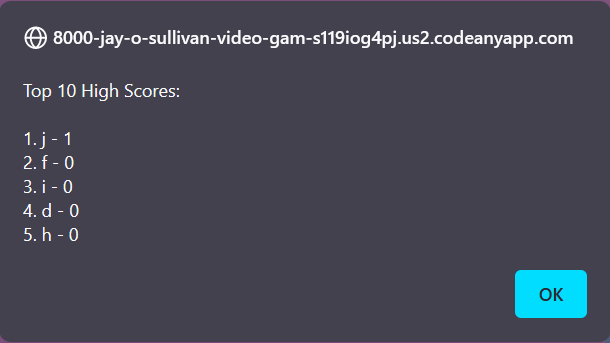

    Responsive design for seamless gameplay on different devices.
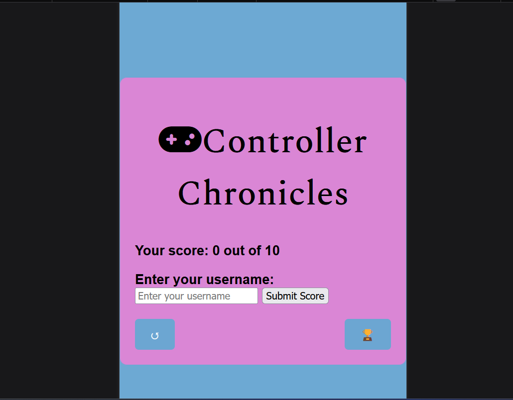

## UX Design

- I have focused on providing an engaging and intuitive user experience for Controller Chronicles.

    Some of the key design considerations include:

    1. A clear and prominent "Start Quiz" button to encourage users to begin the quiz.
    2. Visual feedback for the timer, showing the time left for each question.
    3. Visual indicators for correct and incorrect answers.
    4. A result popup that displays the user's score and invites them to submit their username for the leaderboard.
    5. A dedicated leaderboard popup with a clean presentation of the top 10 high scores.

### Future Enhancements

     Difficulty Levels: Introduce different difficulty levels for the quiz, such as easy, medium, and hard.
     Sound Effects and Music: Enhance the user experience by adding sound effects for correct and incorrect answers.
     Accessibility: Ensure the quiz is accessible to all users.
     Review Incorrect Answers: Allow players to review their incorrect answers after completing the quiz for a learning experience.
     Randomized Questions: Randomize the order of questions to ensure a unique experience for each quiz attempt.

## Technologies Used

The game is built using the following technologies:

- **HTML5** - The markup language used for structuring the website.
- **CSS3** - The stylesheet language used for styling the website.
- **JavaScript** - The programming language used for interactive elements and quiz functionality.
- **Open Trivia Database API** - Provides quiz questions related to gaming.
- **Font Awesome** - A library of icons used for visual enhancements.
- **Google Fonts** - Provides custom fonts for the website, improving the typography.

## Testing

### User Stories

- As a gaming enthusiast, I want to test my knowledge of video games and challenge myself with exciting quiz questions.
- As a casual player, I want a fun and engaging quiz that is easy to understand and play.
- As a competitive gamer, I want to see how I rank against others and have my scores displayed on the leaderboard.
- As a user, I want the quiz to be responsive and accessible, allowing me to play on different devices and browsers.
- As a player, I want to receive instant feedback on my quiz performance and see the correct answers for any questions I miss.
- As a quiz participant, I want the option to submit my score and see it displayed on the leaderboard.

## Validators Used

- [JSvalidator](https://jsvalidator.com/)

    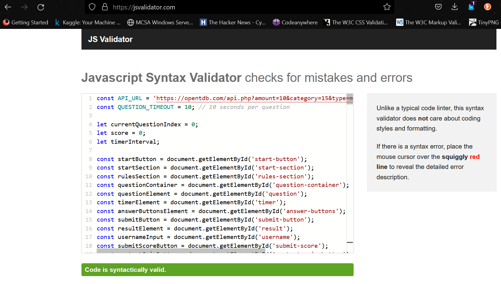

- [W3C](https://validator.w3.org/nu/)

    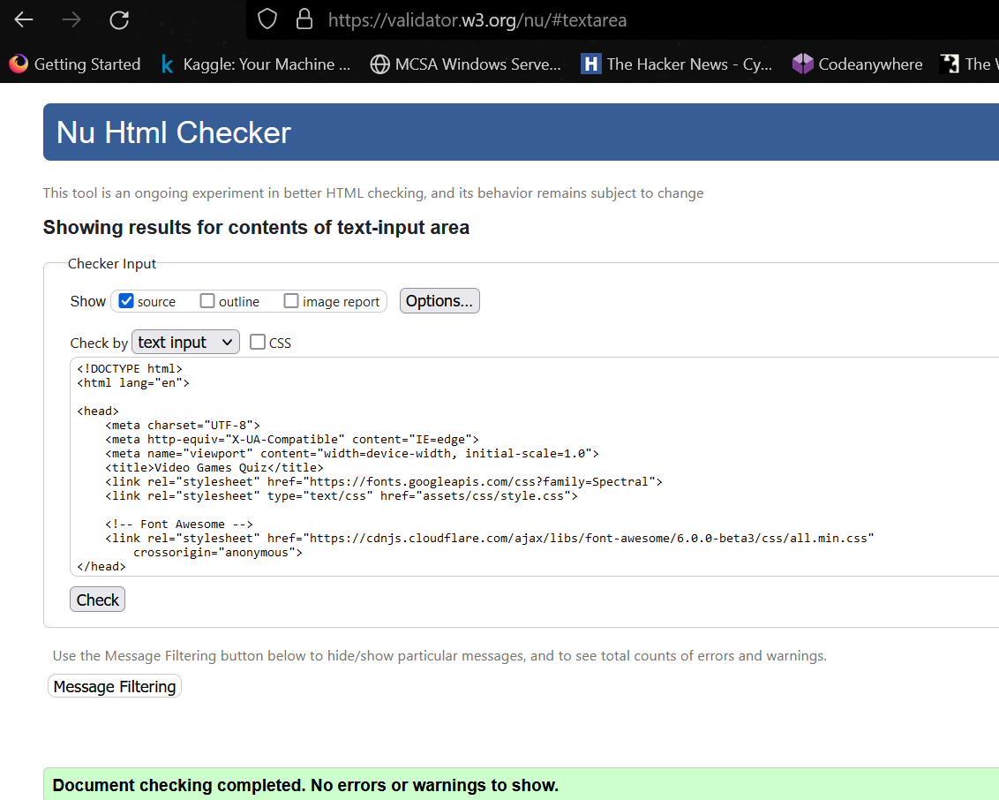

- [W3C](https://jigsaw.w3.org/css-validator/)

    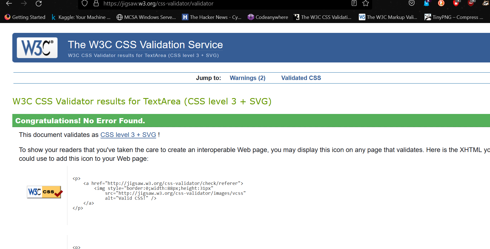

## Getting Started

Controller Chronicles is a web-based application, and no installation is required. Simply access the website using your web browser.

## Demo

To see the live demo of the game, visit [Controller Chronicles: Gaming Quiz Demo](https://jay-o-sullivan.github.io/video-games-quiz/).

### How To Play

    1. Click the "Start Quiz" button on the start screen to begin the quiz.
    2. Read each question carefully and select the correct answer from the multiple-choice options.
    3. You have 10 seconds to answer each question.
    4. Once you answer a question, the quiz will automatically move to the next question.
    5. If you fail to answer within the time limit, the quiz will move to the next question, and your answer will be marked as incorrect.
    6. After completing all the questions, the final score will be displayed along with the number of questions answered correctly.
    7. You can enter your username and submit your score to be displayed on the leaderboard.

## Deployment

The website was created using [CodeAnywhere](https://codeanywhere.com/).

### GitPod

- In GitPod, ensure that all required items have been committed and pushed to GitHub.
- Sign in to GitHub.
- Choose the appropriate repository - jay-o-sullivan/video-games-quiz
- From the menu choose the settings tab.
- Then scroll down to github pages.
  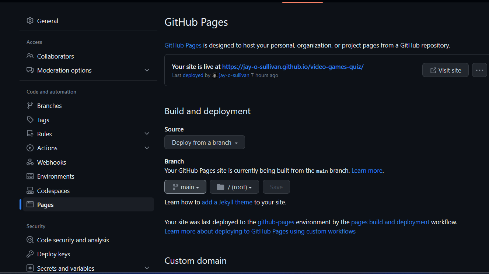
- Click the visit site to view the deployed website.

## Run code locally

There is different approaches should you choose to use GitPod to clone the project, or a different IDE.

- Use web browser -- google -- firefox etc.
- Login to your github account or sign up if you haven't.
- Install the gitpod extenstion for your browser.
- In github find the repository.
- Click on gitpod button.
- New workspace will open containing the project code.

## Cloning

1. Navigate to the github repository.
2. Choose the dropdown on the code button.

    - 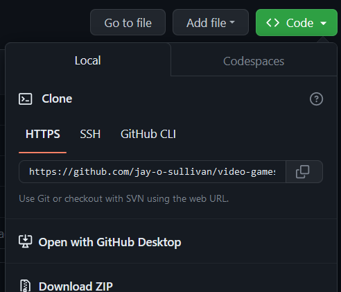

3. Open your IDE and terminal.
4. Set the working directory to location.
5. Type in "git clone" followed by the URL. Make sure to include a space after git clone for the url,   press enter.
6. Project created.
For more information on [GitHub](https://docs.github.com/en)

## API

Controller Chronicles fetches quiz questions from the Open Trivia Database API. The API provides a wide range of trivia questions for various categories, including gaming.

## Credits

### Content

- [Code Institute Solutions - README Template](https://github.com/Code-Institute-Solutions/readme-template)
- [W3 Schools](https://www.w3schools.com/)
- [Youtube](https://www.youtube.com/watch?v=-cX5jnQgqSM) Open API
- [Youtube](https://www.youtube.com/watch?v=pQr4O1OITJo) Timer
- [Coolors](https://coolors.co) Color Palette

### Media

The photo used in this site were obtained from:

- [am i responsive](http://ami.responsivedesign.is/)

## Acknowledgements

- [W3 Schools](https://www.w3schools.com/)  
- [TingPNG](https://tinypng.com/)  image resizing
- [GitHub](https://github.com/jay-o-sullivan/ms2Project/edit/main/README.md)  README template
- Student Support
- Mentor
